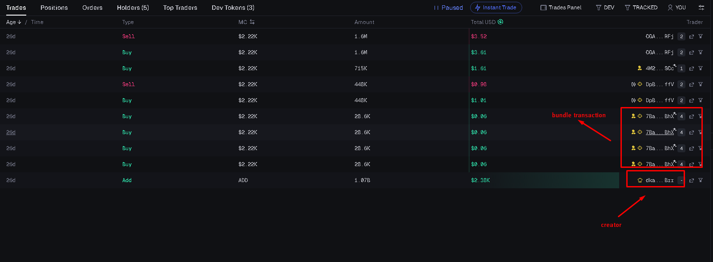
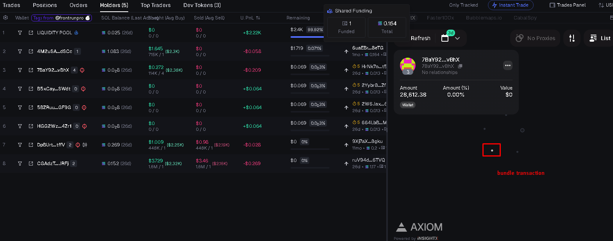
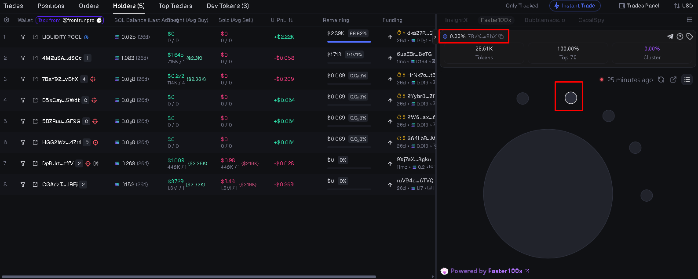
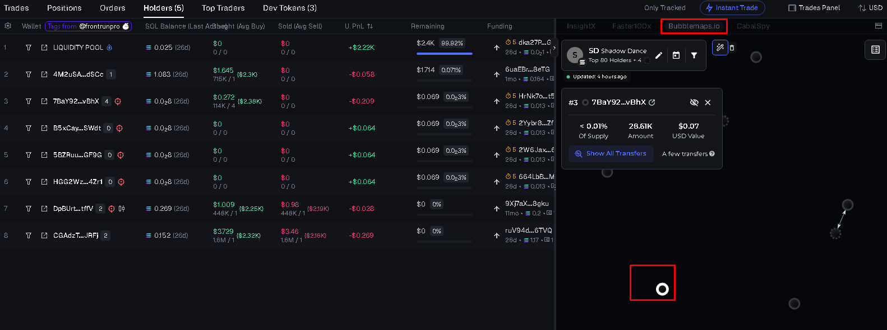

# Pumpfun Stealth Bundler — Bubblemap Bypass

**Launch Pump.fun tokens with zero Bubblemap trace and no bundle detection.** A **pumpfun stealth bundler** that makes your **pumpfun token launch** appear fully organic on Bubblemap, DexScreener, GMGN, and other analytics.

[](https://nodejs.org/)
[](LICENSE)

---

## Table of Contents

- [Overview](#overview)
- [Verified Clean](#verified-clean)
- [Features](#features)
- [Bundle Modes](#bundle-modes)
- [Quick Start](#quick-start)
- [Project Structure](#project-structure)
- [Requirements](#requirements)
- [Disclaimer](#disclaimer)

---

## Overview

**Pumpfun** is a popular Solana token launch platform. This repo is a **pumpfun bundler** with **bubblemap bypass**: your token creation and buys are sent in a single atomic bundle so that on-chain analytics (including **Bubblemap**) do not link your wallets or flag the activity as a bundle.

Use it for a **pumpfun token launch** that looks organic: up to 16 wallets buy in one block via Jito or bloXroute, with no cluster, no bundle link, and no scanner flags.

**Keywords:** pumpfun bundler, bubblemap bypass, pumpfun stealth bundler, pumpfun token launch, pump.fun, Jito bundle, stealth launch.

---

## Verified Clean

Your buyers show up as independent wallets — no cluster, no link, no flag.

| Platform | Result |
|----------|--------|
| **Bubblemap** | No connection detected |
| **Bundle scanners** | Not flagged |
| [Axiom.trade](https://axiom.trade) | Clean |
| [Photon SOL](https://photon-sol.tinyastro.io) | Clean |
| [DexScreener](https://dexscreener.com) | Clean |
| [GMGN](https://gmgn.ai) | Clean |

---

## Test Results

Live on-chain proof:


|-------------|------------|
|  |  |  |  |  |


---

## Features

| Feature | Description |
|--------|-------------|
| **Up to 16-wallet bundle** | Create token and buy with up to 16 wallets in one atomic bundle |
| **Dual engine** | **Jito** or **bloXroute** — switch with one config change |
| **Bubblemap bypass** | Passes Bubblemap and major bundle scanners cleanly |
| **Atomic execution** | Token creation + all buys in the same block |
| **Anti front-run** | Bundle transactions cannot be front-run or sandwiched |
| **Token metadata** | Name, symbol, description, image, social links |
| **IPFS upload** | Image and metadata uploaded to IPFS automatically |
| **Address Lookup Table** | Smaller transactions via on-chain LUT |
| **SOL gather** | Collect SOL from buyer wallets in one command |
| **LUT cleanup** | Close lookup tables and reclaim rent |
| **Status check** | Monitor bonding curve and migration status |
| **Single-wallet mode** | Lightweight single-wallet bundle launch |
| **`.env` config** | All settings in one `.env` file |

---

## Bundle Modes

Set `MODE=1` or `MODE=2` in `.env`.

**`MODE=1` — Jito**
- Up to **16** buyer wallets
- 5 transactions per bundle
- Direct Jito block engine submission

**`MODE=2` — bloXroute**
- Up to **12** buyer wallets
- 4 transactions per bundle (tip added automatically)
- bloXroute Solana trader API

---

## Quick Start

### 1. Install

```bash
yarn install
```

### 2. Configure

```bash
cp .env.example .env
```

Edit `.env`: private key, RPC, token details, and `MODE` (1 = Jito, 2 = bloXroute).

### 3. Launch

```bash
yarn start
```

### Commands

| Command | Description |
|---------|-------------|
| `yarn start` | **Pumpfun token launch** + multi-wallet buy bundle |
| `yarn single` | Single-wallet bundle launch |
| `yarn gather` | Gather SOL from buyer wallets |
| `yarn close` | Close lookup table and reclaim rent |
| `yarn status` | Check token bonding curve status |

---

## Project Structure

```
pumpfun-stealth-bundler-bubblemap-bypass/
├── index.ts                 # Main entry — bundle launch
├── oneWalletBundle.ts       # Single wallet bundle
├── gather.ts                # Gather SOL from buyer wallets
├── closeLut.ts              # Close LUT & reclaim rent
├── status.ts                # Token status
├── constants/
│   └── constants.ts         # Env & constants
├── executor/
│   ├── jito.ts              # Jito bundle submission
│   ├── bloxroute.ts        # bloXroute submission
│   ├── lil_jit.ts          # Lil Jit handler
│   └── legacy.ts           # Legacy executor
├── src/
│   ├── pumpfun.ts          # Pumpfun create & buy instructions
│   ├── main.ts             # Distribution & wallet management
│   ├── bondingCurveAccount.ts
│   ├── globalAccount.ts
│   ├── metadata.ts         # Token metadata
│   ├── uploadToIpfs.ts     # IPFS upload
│   ├── vanity.ts           # Vanity address
│   └── idl/                # Pumpfun program IDL
├── utils/
│   ├── utils.ts
│   └── swapOnlyAmm.ts
├── keys/                    # Generated keypairs
├── image/                   # Token images
├── .env.example
└── package.json
```

---

## Requirements

- **Node.js 18+**
- Solana RPC (e.g. Helius)
- Jito or bloXroute access for the chosen mode

---

## Contact

- [Telegram](https://t.me/crewsxdev)

---

## Disclaimer

This software is for educational and research purposes only. Use at your own risk and in compliance with applicable laws and platform terms of service.

---

**Pumpfun stealth bundler · Bubblemap bypass · Pumpfun token launch**
